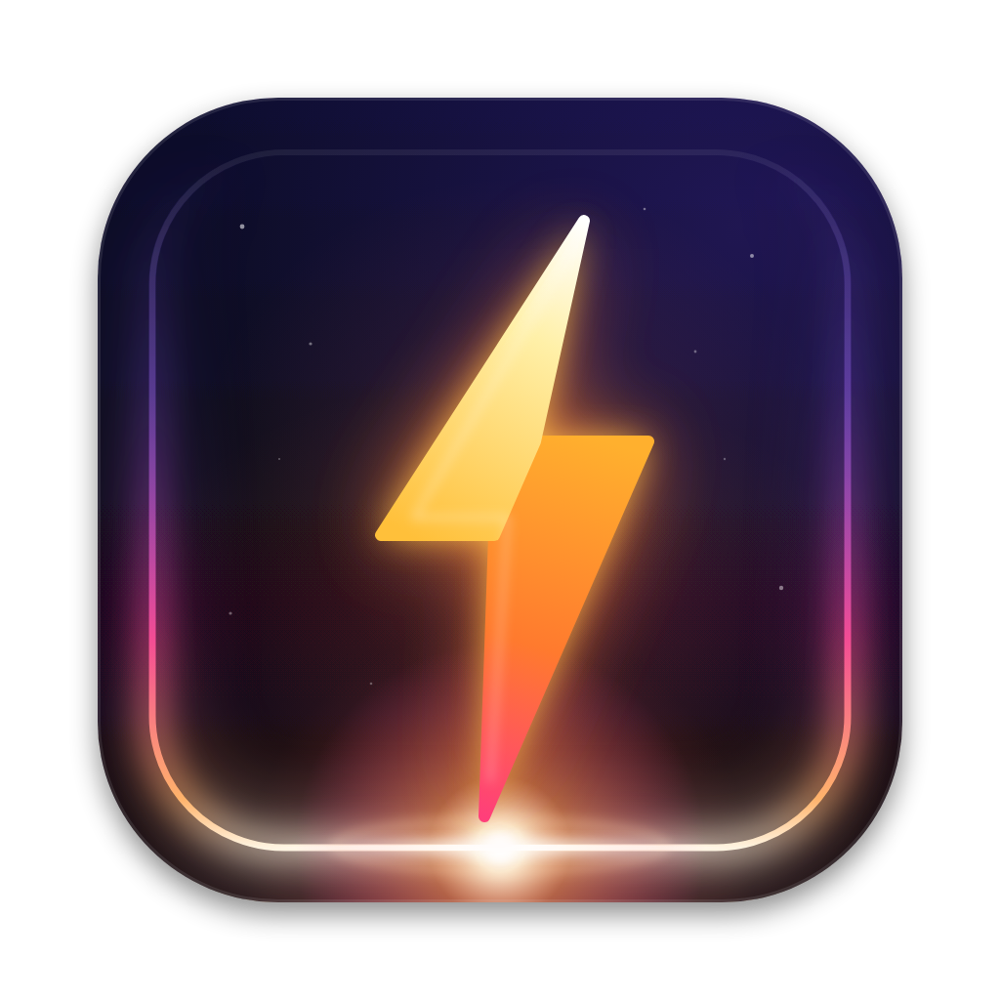

<p align="center">
  
</p>

<h1 align="center">Flash</h1>

<p align="center">A macOS menu-bar app that lights up your screen edges when something is waiting on you:<br>a security key touch, a keychain prompt, or an agent's <code>git push</code> stuck on a passphrase.</p>

<p align="center">
  <a href="https://github.com/sriinnu/flash/releases/latest"></a>
  
  <a href="LICENSE"></a>
</p>

<p align="center">Apple Silicon & Intel · no dependencies · signed and notarized</p>

---

Security keys blink a tiny LED when they want a touch. If you're looking at another window, you miss it, and the signature times out. Flash makes that moment impossible to miss. It works with YubiKey, Google Titan, and any FIDO2/U2F key, and it also catches coding agents (Claude Code, Codex, Cursor) whose `git commit` or `git push` is quietly waiting on your key or passphrase.

## What it catches

| Waiting on you | How |
|---|---|
| FIDO / passkey touch (browser, WebAuthn) | Watches USB security-key traffic |
| SSH commit signing with an `sk-` key | `git-ssh-keygen-flash` wrapper |
| Keychain, password, Touch ID, GPG PIN dialogs | Watches for those system dialogs on screen |
| git/ssh passphrase, PIN, credential, key touch | `flash-askpass` |

It also keeps an **activity log** of commits and successful pushes, with agent vs you, in the menu-bar panel. The log never flashes.

## Install

```sh
brew install --cask sriinnu/tap/flash
```

Or download `Flash-x.y.dmg` from [Releases](https://github.com/sriinnu/flash/releases) and drag it to Applications. Releases are signed and notarized by Apple.

Uninstall with `brew uninstall --cask flash` (add `--zap` to remove settings and logs too).

## Git setup (optional, pick what you need)

```sh
R=/Applications/Flash.app/Contents/Resources

# Alert on SSH commit signing with a security key
git config --global gpg.format ssh
git config --global commit.gpgsign true
git config --global user.signingkey ~/.ssh/id_ed25519_sk.pub
git config --global gpg.ssh.program "$R/git-ssh-keygen-flash"

# HTTPS credential prompts → dialog + alert
git config --global core.askPass "$R/flash-askpass"

# Activity log: record who made each commit/push (agent vs you)
git config --global core.hooksPath "$R/git-hooks"
```

- **ssh prompts** (passphrase, PIN, key touch): turn on **Settings → Detection → SSH prompts via Flash**. This also reaches agents in GUI apps like Claude.app. Relaunch those apps afterwards.
- **Global hooks** run each repo's own hooks first, unchanged. Repos with their own `core.hooksPath` (husky, lefthook) keep it. Undo with `git config --global --unset core.hooksPath`.
- **Apple's `ssh-keygen` lacks FIDO support?** Run `brew install openssh` and set `FLASH_SSH_KEYGEN=/opt/homebrew/bin/ssh-keygen`.

## Use

| | |
|---|---|
| Left-click icon | Status, touches today, recent activity, style switcher, tests |
| Right-click icon | Plain menu |
| Settings (⌘,) | **Alerts** (style, 13 colours, reminders) · **Detection** (prompts, ssh, activity folders) · **About** |
| Logs | `~/Library/Logs/Flash.log` |

## Build

```sh
make run       # build + run in the foreground, logs to the terminal
make install   # → /Applications/Flash.app
make selftest  # with Flash running: triggers every detection path, pass/fail per step
```

Architecture, adding alert styles and releasing are covered in [DEVELOPMENT.md](DEVELOPMENT.md).
